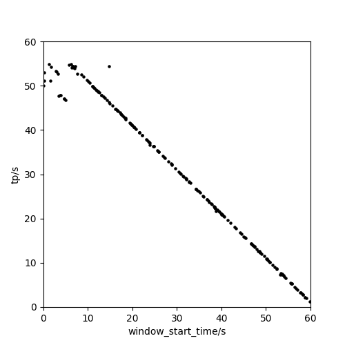

# LSTM-pickP
[LSTM neural network for automatic P phase picking](https://github.com/withwu/LSTM-pickP)  
作者：吴为治 
 
##1.运行基础  
程序运行基于以下库： 
[tensorflow](https://tensorflow.google.cn/install?hl=zh-cn)  
[keras](https://keras.io/)  
[obspy](https://github.com/obspy/obspy)  
[pandas](https://pandas.pydata.org/)  
[numpy](https://numpy.org/install/)  
[matplotlib](https://matplotlib.org/3.1.1/users/installing.html)  
 
##2.文件说明： 
core文件夹： 数据读入、预处理、模型建立以及作图程序。 
data文件夹： train文件夹为训练地震数据集；test文件夹为测试地震数据集；
    train.csv文件为训练集文件目录及人工拾取到时；test.csv文件为测试集文件目录。 
image文件夹：国内用户会存在该readme图片不显示情况，可以下载程序打包文件在此查看。 
output文件夹: 训练好的模型以及结果图输出路径 
config.json文件：程序运行时所需参数 
 
##3.程序运行 
运行run.py 
模型生成   
模型训练   
结果输出   
拾取效果   

运行run2.py! 
生成不同截图时窗可靠性分析图    
